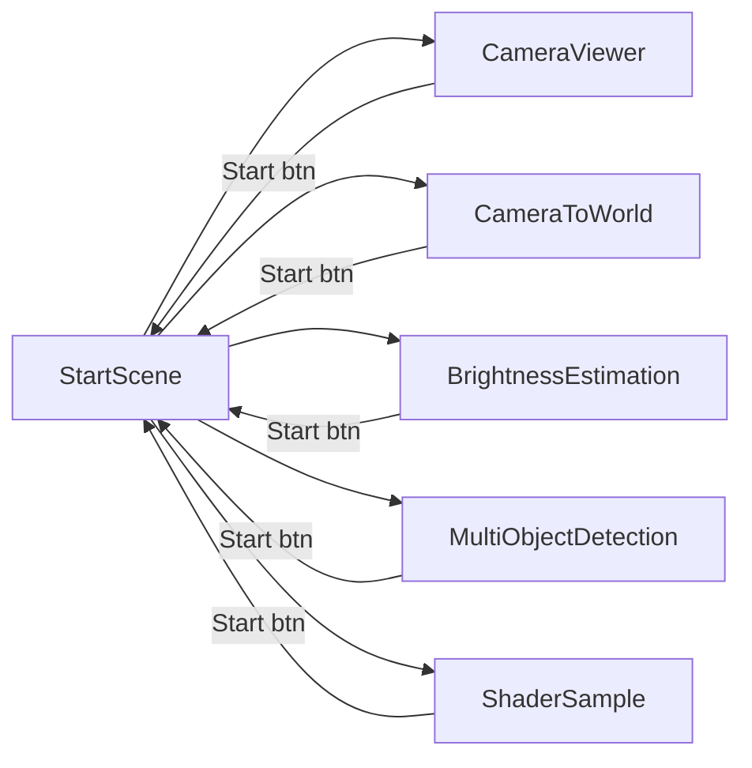
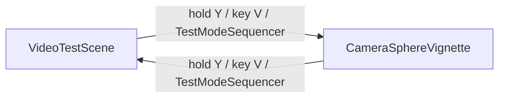

# Scene Flow

Last updated: 2026-07-14

This project now ships **two separate build configurations** from the same repo — do not conflate
them:

1. **Sample suite** (below) — the original Meta sample set, `StartScene` hub.
2. **[Dissertation study build](#dissertation-study-build)** — `VideoTestScene` +
   `CameraSphereVignette` only, no `StartScene`, switched at runtime via `SceneSwitcher`.

## Sample suite

`StartScene` is the entry point (Build Settings index 0). It is the only persistent hub; every
sample is reached from its menu and returns to it via the Start button (`ReturnToStartScene`).

## Build Settings order

| Index | Scene | Role |
|---|---|---|
| 0 | StartScene | Menu hub / entry point |
| 1 | CameraViewer | Sample |
| 2 | CameraToWorld | Sample |
| 3 | BrightnessEstimation | Sample |
| 4 | MultiObjectDetection | Sample |
| 5 | ShaderSample | Sample |

`StartMenu` builds its menu dynamically from these Build Settings entries (skipping index 0), so
adding a scene to Build Settings automatically adds a launch button.

## Permission timing

`RequestPermissionsOnce` (a `RuntimeInitializeOnLoadMethod`) hooks `sceneLoaded`. The first time any
scene **other than StartScene** loads, it requests the `Scene` and `PassthroughCameraAccess`
permissions exactly once for the session.

---

## Dissertation study build

Two scenes only, no `StartScene`. Boot scene: `VideoTestScene`. Switching is a **full
`SceneManager.LoadScene`**, not in-place — the two scenes own different pipelines (`VideoPlayer`
vs. live PCA cameras) — triggered either by the experimenter/participant (hold left `Y` ~1s, or
key `V` over adb) via `SceneSwitcher`, or programmatically by `TestModeSequencer` (the informal
`Test/FinalCountDown`/`Test/TestBlobs` preview harness) when its mode list crosses between a
video-stage mode and a passthrough-stage mode.

| Scene | Role |
|---|---|
| `VideoTestScene` (boot) | Blocks B/C (video). `TestModeSequencer` modes 1–2 (SignPop/no-filter + video). |
| `CameraSphereVignette` | Block A (live passthrough). `TestModeSequencer` modes 3–4 (Hard Dark/no-filter + passthrough). |

`SwitchFeedbackController` (`DontDestroyOnLoad`, bootstraps once) shows a "SWITCHED / PASSTHROUGH"
or "SWITCHED / VIDEO" toast for 2.8s after every load of either scene.

Full details: [Study Tooling](<../systems/study-tooling.md>), [Focus Vignette](<../systems/focus-vignette.md>),
[VideoTestScene](<video-test-scene.md>), [CameraSphereVignette](<camera-sphere-vignette.md>).
