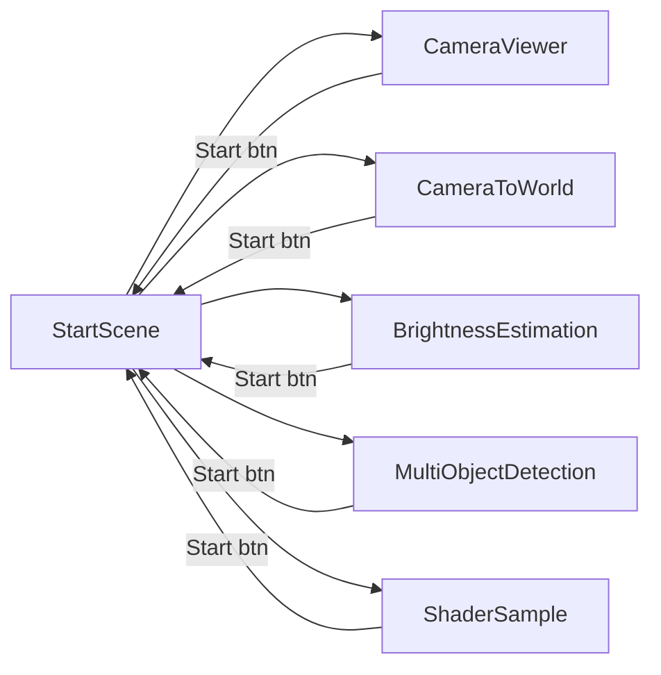

# Scene Flow

Last updated: 2026-06-03

`StartScene` is the entry point (Build Settings index 0). It is the only persistent hub; every
sample is reached from its menu and returns to it via the Start button (`ReturnToStartScene`).

## Build Settings order

| Index | Scene | Role |
|---|---|---|
| 0 | StartScene | Menu hub / entry point |
| 1 | CameraViewer | Sample |
| 2 | CameraToWorld | Sample |
| 3 | BrightnessEstimation | Sample |
| 4 | MultiObjectDetection | Sample |
| 5 | ShaderSample | Sample |

`StartMenu` builds its menu dynamically from these Build Settings entries (skipping index 0), so
adding a scene to Build Settings automatically adds a launch button.

## Permission timing

`RequestPermissionsOnce` (a `RuntimeInitializeOnLoadMethod`) hooks `sceneLoaded`. The first time any
scene **other than StartScene** loads, it requests the `Scene` and `PassthroughCameraAccess`
permissions exactly once for the session.
