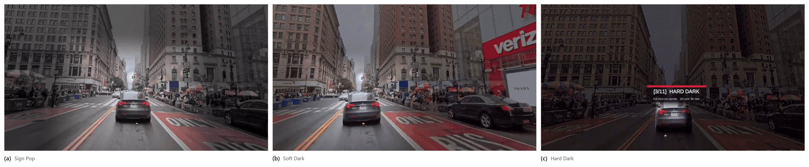

# Chapter 1 — Introduction

## 1.1 Motivation: attention is the scarce resource

The modern visual environment is engineered against sustained attention. Open-plan offices place
moving colleagues at the edge of vision; shared homes put televisions and phone screens beside
workspaces; streetscapes compete for a driver's gaze with advertising designed by professionals to
win it. The cost is well documented: task-irrelevant peripheral events capture attention
involuntarily, and each capture carries a performance penalty on the task the viewer intended to do.
In immersive settings the effect is directly measurable — introducing peripheral visual distractors
into a virtual classroom more than doubled commission errors on a sustained-attention task in a
recent study of sixty-six participants (Frontiers in Human Neuroscience, 2025), replicating decades
of laboratory findings on involuntary attentional capture by peripheral motion and luminance change
(Itti, Koch and Niebur, 1998).

The conventional response of the extended-reality (XR) community to attention problems has been
*additive*: arrows, halos, attention funnels, and highlights layered onto the world to point at what
matters (Biocca et al., 2006). This dissertation pursues the complementary and far less explored
operation: *subtraction*. If the periphery pulls attention away, dim it, mute it, or re-grade it so
that it pulls less. In the literature this family of operations is called diminished reality (DR) —
concealing or attenuating real-world content rather than adding to it (Mori, Ikeda and Saito, 2017;
Cheng et al., 2022) — and its application to distraction has recently been named *visual noise
cancellation*, by direct analogy with the acoustic kind (Hong et al., 2024).

A video-see-through (VST) headset is, in principle, the ideal instrument for visual noise
cancellation. Unlike optical see-through (OST) glasses, whose additive light engines physically
cannot darken the world, a VST headset re-displays the world on an opaque screen: every pixel the
user sees is, in principle, available for modification. The Meta Quest 3 — an affordable, widely
owned consumer device with colour passthrough — would seem to make DR-based attention guidance
deployable at scale for the first time. In principle.

## 1.2 The compositing constraint

In practice, the premise "every pixel is available for modification" is false on consumer hardware,
and that falsity is the motivating technical problem of this dissertation.

On the Quest 3, the passthrough view of the world is composited by the operating system, not by the
application. An application cannot read the passthrough layer, cannot shade it, and cannot spatially
mask it; it may only draw *on top* of it, or apply a global colour transform through a narrow styling
interface. Since early 2025 the platform has additionally exposed the raw forward camera feed to
applications (Passthrough Camera Access), but at materially lower quality than the system passthrough
the user normally sees: a monocular 1280×960 stream covering roughly 85–90° of field of view, versus
the system layer's full coverage of the headset's approximately 110° display, with its correct
per-eye reprojection. The one place where full pixel control exists is therefore also the place where
image quality is worst — and a recent psychophysical study shows the stakes plainly: no current VST
headset reaches normal human visual acuity through its passthrough, with the Quest 3 degrading
further in low light (Wang et al., 2026).

Subtractive attention guidance on this platform is consequently a *compositing-rights problem*. The
effect one wants — "dim everything except the region that matters, without degrading the region that
matters" — cannot be obtained by editing the image the user sees, because no application is permitted
to edit it. Chapter 3 shows that what remains is a narrow but genuinely usable design space, organised
into three tiers of access, and Chapter 4 presents a working system that exploits an architectural
inversion at its centre: the region that matters is rendered as an *absence* — a transparent window
in an overlay — so that the highest-quality image on the device, the native system passthrough,
serves the focus region for free, while the manipulation is confined to the periphery where acuity is
lower and precision matters less. On the same principle, the system's most capable mode composites
native passthrough inside the window with a shader-processed camera feed outside it — a hybrid for
which a structured prior-art search (Chapter 2) found no published or shipped precedent.

## 1.3 One question, two halves

The dissertation asks a single question:

> **Can subtractive attention guidance be delivered on consumer XR hardware — and when it is
> delivered, does it actually help human attention?**

The two halves of the question structure the entire work.

**Part T (technical): can it be built?** What degree of diminishment control is achievable on a
consumer VST headset without OS-level access to the passthrough layer, and at what cost to image
quality, field of view, latency, and comfort? Part T is answered by the design space (Chapter 3), the
reference implementation (Chapter 4), and the technical evaluation (Chapter 5).

**Part H (human): does it work?** Under controlled distraction, does peripheral diminishment reduce
the cost distractors impose on a focal task — and does salience re-grading speed focal detection
without unacceptably degrading peripheral awareness? Part H is answered by a pre-registered user
study, whose design and results are both reported in Chapter 6.

Two methodological commitments connect the halves and should be named at the outset, because they are
choices rather than accidents.

First, the study's dynamic scenario runs as a *simulation*: pre-recorded driving footage presented on
the system's rendering sphere, rather than live passthrough of a street. This follows the precedent
of the closest published DR evaluations, which simulated diminishment inside virtual environments
because controlled, repeatable, event-dense stimuli cannot be obtained from the uninstrumented real
world (Cheng et al., 2022; McLaughlin et al., 2025). Second, the perception problem is
deliberately decoupled from the attention question — but from *live, on-device* detection
specifically, not from detection itself. SignPop, the mode evaluated in the driving block, is not
detector-free: its signal pop, a locally opened window over the object, a saturation and brightness
lift, and a darkened surround are all gated on a single detection signal (Chapter 4, Section 4.5.6).
What makes the decoupling real is where that signal comes from — an *oracle*, computed once,
offline, at full resolution over the study footage (Chapter 5, Section 5.6), never from a model
running on the headset during a session. The oracle is used exactly as an oracle is meant to be
used: it lets the study ask whether an effect built on excellent detection helps attention, without
first having to engineer excellent detection on-device. The human-factors finding therefore does not
depend on today's on-device detection quality — but it does depend on oracle-quality coverage, and
Chapter 5 sets out the gap between that coverage and what a live pipeline
currently achieves, which conditions how far the finding travels toward a deployed system. Nor does
the current design distinguish which of the gated effects — the colour pop, the opened window, or
the saliency lift — is responsible for any measured benefit; that limitation is carried forward
explicitly in Chapter 6. Crucially, the two study blocks bracket the feasibility spectrum:
the primary (workstation) block runs on *real passthrough over a real display carrying real moving
distractors* — the
actual artefact, no simulation — while the secondary (driving) block evaluates the concept in the
simulated deployment context.

## 1.4 Research questions and hypotheses

Three research questions operationalise the spine question. They are stated here in summary; their
full pre-registered form — including smallest effect sizes of interest, equivalence margins,
statistical tests, and a decision table committing the dissertation to a conclusion under every
outcome — is given in Chapter 6.

- **RQ1 (primary).** Under sustained peripheral distraction, does peripheral DR dimming (Hard Dark,
  world-locked window) improve performance on a focal workstation task?
  *Hypothesis H1:* focal-task accuracy is higher with the vignette active than without it, measured
  as a paired within-participant difference under a distractor reel that runs throughout both
  conditions.
- **RQ2 (secondary).** Does SignPop's detection-gated salience re-grading speed detection of
  focal-region events in a dynamic scene without degrading peripheral event detection beyond an
  acceptable margin?
  *Hypotheses H2a/H2b:* central probe reaction time improves (H2a), and peripheral probe hit rate is
  equivalent within a 10-percentage-point margin (H2b) — a safety hypothesis tested by equivalence,
  such that failing it is a conclusive negative finding rather than an ambiguous null.
- **RQ3 (exploratory).** How do the three modes compare subjectively on comfort, perceived focus
  benefit, and willingness to use, when sampled on a common stimulus?

The design philosophy behind these hypotheses deserves one sentence here: the study is built so that
it cannot return "inconclusive". Distraction is held constant and known to be costly; the study asks
whether the system improves performance against it, and pre-commits to the interpretation of every
outcome, including failure.

## 1.5 Contributions

- **C1 — Design space.** A taxonomy of DR capability under compositing constraints on consumer VST
  hardware — three access tiers, with the achievable effects, ceilings, and costs of each —
  characterised empirically rather than speculatively (Chapter 3).
- **C2 — Reference implementation.** An open, working multi-mode DR attention-guidance system on
  Quest 3 passthrough: the world-locked focus-window-as-absence architecture, world-direction fusion
  sampling that lets a monocular camera feed fuse binocularly, motion-coupled comfort suppression,
  and ten peripheral treatments spanning the three-tier space, of which two are carried to
  confirmatory evaluation — SignPop (detection-gated salience re-grading) and Hard Dark (full
  peripheral occlusion) — with documented failure modes (Chapter 4).
- **C3 — Technical evaluation.** Measured frame cost against the 72 Hz budget and measured legibility
  across rendering paths, quantifying the quality advantage that motivates the window architecture,
  with results from the offline detection pipeline and a stated account of which benchmarks remain
  unrun (Chapter 5).
- **C4 — Pre-registered user study and its results.** A falsifiable within-subjects design with a
  single primary hypothesis, equivalence-bounded safety testing, and a pre-committed decision table,
  executed on 18 participants. Focal-task accuracy improved by 3.09 percentage points under
  peripheral dimming (95 % CI +0.62 to +5.55, 82 % achieved power); peripheral awareness was
  non-inferior under salience re-grading; and the dynamic-scene detection benefit localised to the
  20–30° band immediately outside the focus window (+17.55 points, 84 % power) (Chapter 6).

## 1.6 Scope: what this dissertation does not claim

Because the credibility of a small, carefully scoped study depends on the discipline of its claims,
the non-claims are stated as prominently as the claims.

**No driving or road-safety claims.** The driving footage used in the secondary study block is a
dynamic, high-event-rate monitoring *stimulus*. A seated participant passively watching
passenger-perspective video licenses no inference about driving, drivers, or road safety; such
inference would require a driving simulator with vehicle control, which is out of scope.

**No product claims.** The study evaluates attention mechanisms under controlled distraction, not the
desirability or readiness of a wearable product. Comfort findings from a 2026 headset transfer to
future lighter hardware only as bounds, and are reported as such.

**Oracle conditioning stays visible.** SignPop's finding depends on detection — on offline,
oracle-quality detection, not on live, on-device detection. Every place this dissertation reasons
about a live or on-device detector, that reasoning is conditioned on the oracle bound that Chapter 5
measures, and marked accordingly; oracle performance is never substituted for live performance
without saying so.

**Claims are bounded by what was measured.** The user study ran on 18 participants and the
technical benchmarks are partially complete: frame cost and legibility are measured, while
world-locking stability, thermal endurance, and the oracle-versus-live detection gap are not.
Chapter 5 marks which is which, and Chapter 6 reports every pre-registered test including those
its sample cannot resolve. Where a result is a bounded estimate rather than a demonstrated effect,
it is labelled as one.

## 1.7 Roadmap

Chapter 2 surveys the literature across diminished reality, saliency modulation and gaze guidance,
foveated rendering, attention guidance in driving and workstation contexts, and human-factors
foundations, closing with the research gaps this work addresses and a documented prior-art search for
the system's core architecture. Chapter 3 develops the three-tier design space of DR under
compositing constraints. Chapter 4 presents the system: architecture, the three modes, interaction
design, and the engineering record including dead ends. Chapter 5 reports the technical evaluation.
Chapter 6 presents the pre-registered user study
design in full and reports its results. Chapter 7 discusses those results, threats to validity, and
transfer — including what does and does not carry to optical see-through hardware. Chapter 8
concludes.

**Figure 1.1 —** The three peripheral treatments on the same driving scene, captured on device.
**(a)** Sign Pop desaturates the periphery while holding the red and orange of road markings and
signage at full strength. **(b)** Soft Dark attenuates the periphery without removing it.
**(c)** Hard Dark takes the attenuation to its limit. In all three the focus window sits at the
centre and is left untouched, so the region the viewer is working in reaches the eye through the
headset's own passthrough rather than through the effect. Panel (c) carries the build's on-screen
mode badge.

[Figure 1.2 — The two-part structure of the dissertation: Part T (design space → system → benchmarks)
and Part H (pre-registered study), with the workstation block bridging them on real hardware.]

## References (this chapter)

- Ai, X., Wang, Y., Wang, P., & Wang, S. (2025). Impact of visual distractors in virtual reality
  environments on sustained attention behavioral performance and EEG characteristics. *Frontiers in
  Human Neuroscience*. https://pmc.ncbi.nlm.nih.gov/articles/PMC12698649/
- Biocca, F., Tang, A., Owen, C., & Xiao, F. (2006). Attention funnel: omnidirectional 3D cursor for
  mobile augmented reality platforms. *Proc. CHI 2006*. https://ieeexplore.ieee.org/document/1579336/
- Cheng, Y., Yin, H., Yan, Y., Gugenheimer, J., & Lindlbauer, D. (2022). Towards understanding
  diminished reality. *Proc. CHI 2022*. https://dl.acm.org/doi/10.1145/3491102.3517452
- Itti, L., Koch, C., & Niebur, E. (1998). A model of saliency-based visual attention for rapid scene
  analysis. *IEEE TPAMI, 20*(11).
- McLaughlin, A. C., et al. (2025). Cognitive aid design using diminished reality to support selective
  attention by reducing distraction. *Human Factors*, 67(9), 937–961. doi:10.1177/00187208251325169
- Mori, S., Ikeda, S., & Saito, H. (2017). A survey of diminished reality: techniques for visually
  concealing, eliminating, and seeing through real objects. *IPSJ T-CVA, 9*(17).
  https://link.springer.com/article/10.1186/s41074-017-0028-1
- Wang, J., Ping, S., Xu, K., Li, Y., & Liang, H.-N. (2026). The perceptual gap between video
  see-through displays and natural human vision. *arXiv 2601.02805*. https://arxiv.org/pdf/2601.02805
- Hong, J., Langlotz, T., Sutton, J., & Regenbrecht, H. (2024). Visual Noise Cancellation: Exploring
  Visual Discomfort and Opportunities for Vision Augmentations. *ACM Transactions on Computer-Human
  Interaction.* doi:10.1145/3634699
- Laghari, M. K., Shaikh, A. A., Khan, F., & Siddiqui, A. G. (2025). Native mixed reality compositing
  on Meta Quest 3: a quantitative feasibility study of ARM-based SoCs and thermal headroom. *arXiv
  2509.18929*. https://arxiv.org/abs/2509.18929
