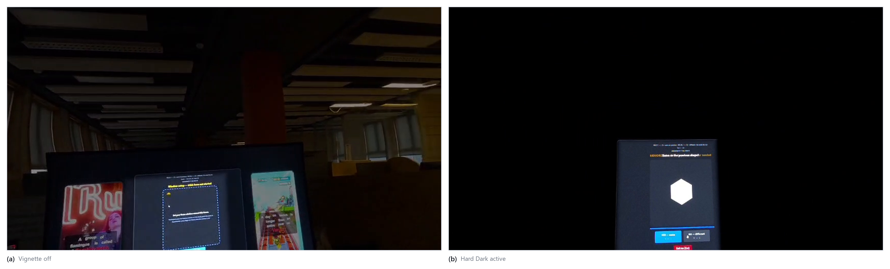
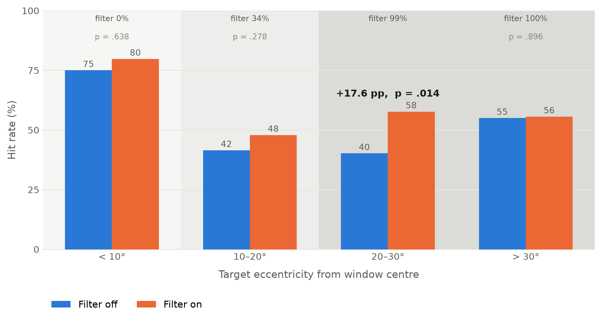

# Chapter 6 — User Study Design and Results

Hypotheses, margins and analysis choices were fixed before collection began. Sections 6.1 to 6.10
give the design; Section 6.11 reports what it produced.

## 6.1 Rationale and Methodological Positioning

### 6.1.1 What the study must be able to conclude

The purpose of this study is to determine whether the diminished-reality (DR) attention-guidance
system described in Chapters 3 and 4 *works* — and, just as importantly, to be able to determine that
it *does not* work, if that is what the data show. A study that can only confirm is not an
experiment; it is a demonstration. Two design defects make that failure easy to fall into: an
underpowered between-subjects allocation, and safety hypotheses phrased as bare nulls, which cannot
fail informatively because a non-significant difference in a small sample is evidence of nothing.
The design below avoids both.

It removes the possibility of an inconclusive outcome by anchoring the research question to an
effect already established in the literature. Peripheral visual
distractors reliably impose a measurable performance cost on a focal sustained-attention task in a
head-mounted display: in a virtual-classroom Go/No-go study with 66 participants, commission errors
more than doubled in the presence of peripheral distractor events (1.33 → 3.15, *p* < .001), with
omission errors showing the same pattern (Ai et al., 2025). The primary question is therefore not the unconstrained "does the
vignette make people better?" but the falsifiable:

> *Peripheral distractors impose a measurable cost on a focal task. Does the DR vignette reduce that
> cost?*

Under this framing, every outcome is informative. The distractor reel runs throughout both
conditions, so distraction is held constant and the vignette is the only thing that changes between
them. If the vignette works, performance improves when it is active. If it does nothing, the two
conditions come out level — a bounded, conclusive negative. The failure mode that would render the
comparison insensitive, distractors too weak for the vignette to have anything to suppress, is
checked before collection begins (Section 6.8.2). No configuration of results yields
"inconclusive".

### 6.1.2 Simulation-based evaluation and the oracle-perception assumption

The study occupies a deliberate position between concept evaluation and artefact evaluation, mirroring
the dissertation's two-part structure (Chapter 1). Two named methodological commitments govern this
position.

First, the dynamic (driving) block is a **simulation-based evaluation**. Participants view
pre-recorded equirectangular driving footage rendered on the system's sphere rather than a live street
scene, in the tradition established by Cheng et al. (2022), who evaluated DR concepts entirely inside
VR simulations because live DR was not feasible. Simulation gives every participant identical,
repeatable, event-dense stimuli — something no real environment provides — at a known cost to
ecological validity that is declared rather than obscured: no claim in this dissertation concerns
driving, drivers, or road safety. The driving footage is a dynamic, high-event-rate monitoring
stimulus, nothing more (see the claim-scoping rules in Chapter 1).

Second, the perception problem is **decoupled from the attention question — but from *live,
on-device* detection specifically, not from detection itself**. SignPop, Block B's evaluated mode,
is not detector-free: its colour pop, a locally opened window over the detected object, and a
saliency lift are all gated on a single detection signal (Chapter 4, Section 4.5.6). That signal
comes from an oracle — the offline full-resolution detection bake — computed once, in advance, never
from a model running during a session; every stimulus is otherwise deterministic and scripted. The
oracle is used exactly as an oracle is meant to be used: it lets the study ask whether an effect
built on excellent detection helps attention, without first building excellent detection on-device.
The human-factors finding therefore does not depend on today's on-device detection quality — but it
does depend on oracle-quality coverage, and Chapter 5's oracle-vs-live benchmark measures the size of
the gap between that coverage and what a live pipeline currently achieves, which conditions how far
the finding travels toward a deployed system. Nor does the current design distinguish which of the
gated effects — the colour pop, the opened window, or the saliency lift — is responsible for any
measured benefit; Section 6.10.2 carries this forward as a stated limitation.

Critically, the two confirmatory blocks sit at opposite ends of this spectrum. Block A (workstation)
runs on **real passthrough, with the vignette rendered by the headset over a real display carrying
real moving distractors** — it evaluates the actual artefact as built. Block B (driving) runs on the simulated video scene — it evaluates the concept under the
ideal-context assumption. Convergence between them strengthens both; divergence is itself a
reportable finding about what simulation-based XR evaluation misses.

### 6.1.3 Why within-subjects with repeated trials

The design is fully within-subjects, with no between-subjects factors, targeting **N = 20 analysed
participants** and a high trial count per condition. Collection reached 18 participants, yielding 17
paired on the primary block (Section 6.11.1). Three considerations justify this choice over the
superficially more ambitious alternative of a larger between-groups design.

First, precedent: the two closest published DR evaluations are within-subject. Cheng et al. (2022)
ran their two studies at N = 16 and N = 12; McLaughlin et al. (2025) ran two within-subject
experiments analysed with linear mixed-effects models. Second, field norms: Caine (2016) found the
modal sample size across all CHI user studies to be 12, with in-person studies drawing their
statistical power from repeated measures rather than headcount. Third, arithmetic: each participant
will contribute approximately 140 scored task events per Block A condition (under the virtual task
option) and 24 probe events per Block B condition. Twenty participants therefore yield on the order
of 11,000 Block A trials — a dataset that trial-level mixed models can exploit fully, while
per-participant aggregates feed classical paired tests as robustness checks. A between-subjects
design at feasible recruitment numbers would discard the within-person variance control that makes
small-N studies conclusive. The realised sample reached 82 % power on the primary endpoint
(Section 6.11.2); an equivalent between-groups allocation at the same headcount would have had
little chance of detecting the effect that was found.

## 6.2 Research Questions and Pre-Registered Hypotheses

**RQ1 (primary).** Does peripheral DR dimming (Hard Dark, world-locked window) reduce the performance
cost that peripheral visual distractors impose on a focal workstation task?

**RQ2 (secondary).** Does SignPop's detection-gated salience re-grading speed detection of
focal-region events in a dynamic driving scene, and does it do so *without* degrading peripheral
event detection beyond an acceptable margin?

**RQ3 (exploratory).** How do the three modes (SignPop, Soft Dark, Hard Dark) compare subjectively on
comfort, perceived focus benefit, and willingness to use, when sampled on a common stimulus?

Every hypothesis below is stated with the observation that would refute it. A hypothesis without a
refuting observation is not admitted to the design.

| ID | Hypothesis (directional, falsifiable) | Refuting observation | Status |
|---|---|---|---|
| **H1** | Block A accuracy is higher with the vignette On than Off, under the distractor reel that runs throughout both conditions. | The paired estimate's 95 % CI includes zero, or the difference is reversed. | Primary confirmatory |
| **H2a** | With SignPop On, median reaction time to central probes (< 10° from the focus centre) is lower, and central hit rate is not lower, than with the vignette Off. | Central RT not reduced (95 % CI on the paired difference includes 0 or favours Off). | Secondary confirmatory |
| **H2b** | With SignPop On, peripheral probe hit rate (25–40° eccentricity) is *equivalent* to Off within a margin of Δ = 10 percentage points (two one-sided tests, TOST). | Equivalence not established and the point estimate shows a drop > 10 pp — a conclusive finding that the mode harms situational awareness. | Secondary confirmatory (safety) |
| **H3** | NASA-TLX global workload in Block A is lower with the vignette On than Off. | No TLX difference, or higher workload with the vignette. | Secondary |
| **EQ1–EQ3** (exploratory) | Sampler ratings (comfort, perceived focus benefit, willingness to use) differ across SignPop / Soft Dark / Hard Dark. | — (exploratory; no confirmatory claim attaches) | Exploratory |

**H1 contrast rationale.** H1 is tested as a paired accuracy difference between the two vignette
conditions. Both run under the same distractor reel, so the comparison isolates the vignette and
needs no distractor-absent baseline. The established distractor cost documented in the literature is
the backdrop against which the manipulation operates rather than a factor the study measures, which
keeps the design to a single within-participant contrast and spends the whole session budget on
trials that inform it. H2b's 10-percentage-point margin reflects the safety framing inherited from the DR
focus-versus-awareness trade-off documented by McLaughlin et al. (2025) and Murph et al. (2021):
in a monitoring context, losing more than one peripheral event in ten to the
overlay is an unacceptable awareness cost. Equivalence testing follows Lakens (2017); the earlier
methodology's bare-null phrasing of this hypothesis is thereby replaced with a test that can fail.

## 6.3 Participants, Ethics, and Apparatus

### 6.3.1 Participants

Twenty-four adults will be recruited (target: 20 analysed, with four spares against dropouts and
pre-registered exclusions). Inclusion criteria follow the approved ethics protocol: aged 18 or over,
normal or corrected-to-normal vision, no self-reported vestibular disorders. Prior VR experience is
recorded on a four-level scale (never / a few times / monthly / weekly or more) and used as a
robustness covariate rather than a selection criterion, since the deployed system must serve VR-naïve
users.

### 6.3.2 Ethics and safety

The study runs under the ethics approval obtained for the earlier protocol version, with each
difference between that protocol and the present design classified (unchanged / minor /
requires-wording-check) in a delta table reviewed with the supervisor before the pilot week. The
substantive task classes — seated video viewing, button presses, digit cancellation, on-screen video as
distractors, NASA-TLX — are unchanged. Items requiring a wording check before use include the virtual
task panel (if the pilot selects it over the approved paper task), audio recording of the Block C
interview (experimenter notes are the fallback), and the stated session duration on the information
sheet.

Sickness risk is managed by design and by rule. By design: all tasks are seated, there is no
artificial locomotion, total headset time is under 45 minutes, and a headset-off break separates the
two confirmatory blocks. By rule, a written **stop rule** is applied without discussion: the VR
portion terminates immediately if the participant reports nausea or dizziness at a moderate or worse
level at any comfort check or spontaneously, or if the experimenter observes distress. Comfort checks
are scheduled at the headset-off break after Block A and — mandatorily — after Block B, where the
check doubles as the Block C skip gate (Section 6.7); additional checks occur between any conditions
on request. After
termination the participant rests seated, is offered water, and remains until symptoms subside; data
collected up to termination are retained per the consent wording, and the participant is replaced
from the spare pool. The Virtual Reality Sickness Questionnaire (VRSQ; Kim et al., 2018) is
administered **pre and post** session — pre-administration is essential because post-only sickness
scores are uninterpretable without a baseline (Brown, Spronck & Powell, 2022).

### 6.3.3 Apparatus

All sessions use the same Meta Quest 3 headset with controllers (hand tracking disabled), in the same
room, with bright constant lighting at a marked setting — Quest 3 passthrough acuity degrades
markedly in low light (Wang et al., 2026), so lighting is a controlled variable, not a convenience. The participant sits on a fixed chair at a desk. The
experimenter monitors the participant's view live via an `scrcpy` mirror. The mirror is not
recorded: the ethics approval does not permit recording of participant sessions, so the only data
retained from a session are the logged telemetry and the questionnaire responses. Every stimulus in
every block is deterministic and scripted from versioned
schedule files; no live object detection runs anywhere in the study. Instrumentation (the
`StudyLogger` telemetry component, condition sequencer, probe scheduler, and post-session validator)
is specified in the tooling appendix of the operational protocol and summarised in Section 6.10.

## 6.4 Design Overview

### 6.4.1 Structure

| Property | Value |
|---|---|
| Design | Fully within-subjects; no between-subjects factors |
| N | 20 analysed (24 recruited) |
| Session length | ~53 minutes including consent and debrief; Block C is last and skippable |
| Blocks | A — workstation 2×2 (primary); B — driving probes, 2 conditions (secondary); C — compact three-mode sampler (exploratory) |
| Counterbalancing | Block A: 4×4 balanced Latin square over its four conditions (four order groups × five participants). Block B: condition order alternated by participant parity (10 SignPop-first, 10 Off-first). Block C: three mode orders from a 3×3 Latin square, cycled 7/7/6. |
| Block order | Fixed A→B→C for all participants: A is primary and must come freshest; C is exploratory and absorbs any fatigue. Acknowledged as a limitation (Section 6.10.2). |

Within each block, the stimulus material, seating, lighting, controller, and task are identical
across conditions; only the shader state differs. In vignette-off conditions the focus window is
still painted and locked by the participant, so the motor and procedural experience is identical
across conditions — the vignette is isolated as the sole independent variable.

### 6.4.2 Why these modes, and why these pairings

The three modes are not interchangeable strengths of a single effect; they occupy distinct positions
in the design space of Chapter 3, and each block pairs a mode's *mechanism* with the task paradigm
able to detect it.

**Hard Dark is assigned to Block A** because dark modes *remove* peripheral signal, and the
workstation paradigm measures precisely what removal should buy: a reduced distractor cost. Hard Dark
is preferred over Soft Dark for the confirmatory test because it is the strongest manipulation,
maximising the probability of detecting the mechanism if it exists.

**SignPop is assigned to Block B** because it does not primarily remove signal; it *re-grades
salience*, gated on a detected object rather than colour class alone. The probe-detection paradigm
measures what re-grading should buy — faster focal detection (H2a) — and what it must not cost —
peripheral awareness (H2b).

**Soft Dark appears only in Block C**, and its retention deserves explicit defence, since SignPop
now also dims its periphery and a reader might reasonably ask whether Soft Dark is redundant. It is
retained not as "a weaker Hard Dark" but as the design space's load-bearing middle point, on four
grounds. First, it is the **minimal manipulation**: pure luminance attenuation, the only unconfounded
member of the mode family, whereas SignPop bundles desaturation, salience re-grading, glare
compression, a detection-gated pass-through window, and dimming into one composite (Section 4.5.6).
Second, it is the graded **Tier-2** point in the
compositing hierarchy of Chapter 3: dimmed *real* passthrough at native quality, rather than a
re-rendered camera copy. Third, it has **no camera pipeline**, which makes it the only mode plausibly
deployable for hour-long sessions: the one published feasibility study of on-device processing of the
passthrough camera feed projects thermal throttling within five to ten minutes (Laghari et al., 2025,
arXiv:2509.18929) — a simulation-based estimate, not a measured on-device run.
Fourth, it is the **awareness-preserving** point between full signal and Hard Dark's blackout — the
region of the design space where the focus-versus-awareness trade-off actually lives. A full
confirmatory block for Soft Dark does not fit the session budget; it therefore receives sampler-level
subjective data only, an explicit and stated trade-off.

**The mode × scenario confound is stated plainly.** Hard Dark is tested only at the workstation and
SignPop only in the driving scene. All confirmatory claims in this dissertation are therefore
*mode-in-context* claims ("Hard Dark reduces distractor cost in a workstation task"), never
mode-generalised claims ("dark vignettes work"). Block C softens the confound slightly by exposing
all three modes on a single common stimulus, but for subjective ratings only.

## 6.5 Block A — Primary: Workstation Focus (Hard Dark, real passthrough)

Block A answers the primary question: does blacking out the periphery around a world-locked focus
window reduce the cost that real peripheral distractors impose on a focal task?

### 6.5.1 Physical layout and distractor stimulus

Participants wear the headset in passthrough with the vignette under test active, and perform the
1-back task on a 42-inch monitor (930 mm wide) viewed through passthrough, seated approximately
600 mm from the screen.

The display presents three regions side by side, rendered by a single page
(`PilotTools/block-a-cpt.html`) so that their relative geometry is fixed by the layout rather than
by per-session placement, and is identical for every participant. The task panel occupies a
1100-pixel-wide central column. A video panel flanks it on each side, 500 pixels wide by up to
880 pixels tall, styled with a rounded bezel so that it reads as a device propped on the desk rather
than as a band of video, and held 120 pixels clear of the task frame.

At the display width and viewing distance used, this geometry places each distractor panel's centre
**36.6° off axis**, spanning 28.4° at its inner edge to 43.4° at its outer edge. That places the
distractors in the near periphery, the zone of maximal involuntary attentional capture identified by
the Useful Field of View literature (Ball & Owsley, 1993). Note that Ball and Owsley define and
validate the UFOV *test*; the approximately 30° extent invoked here is the conventional figure from
that literature rather than a value stated in their paper.

**Figure 6.1 —** The Block A display recorded through the headset. **(a)** With the vignette off,
the whole room is visible along with all three regions of the display: the task panel at centre and
a video panel to either side, both playing the distractor reel. **(b)** With Hard Dark active, the
focus window admits the task panel alone at full passthrough quality while everything outside it,
including both distractor panels, is occluded. The panel in (b) shows a scored trial, with the
current shape and the two response buttons. Both frames come from a researcher demonstration
capture of the apparatus made on 29 July 2026 with no participant present; the ethics approval does
not permit recording of participant sessions, so no figure in this dissertation shows one.
Passthrough exposure and the capture codec make the room in (a) darker than it appeared in the
session lighting.

The flanking panels play the study's **distractor reel**: fast-cut, high-motion video with scheduled
salient event bursts, drawn from a fixed set and identical across participants. The set used in each
run is recorded in the run-start payload, so the stimulus is recoverable from the data rather than
from session notes. The panels stay dark during setup and results and light up only when a scored
run begins, so distraction is present for exactly the measured interval and no longer. **The reel
runs throughout every condition**, so distraction is held constant and the vignette is the only
thing that changes between them.

Rendering the distractors on the same display as the task, rather than on separate physical screens,
fixes their eccentricity by construction: every participant sees the same angular layout as long as
seating distance is held constant, with no per-session placement to measure or drift. The cost is
that eccentricity depends on seating distance rather than on a fixed apparatus position, so small
differences in how participants sat are uncontrolled. Seating distance is recorded on the
per-session checklist (Section 6.10.1).

One measure specified in Section 6.5.4 was not captured. Head-turns toward the distractor panels
require head-pose telemetry, and the browser-based task page receives no telemetry from the headset,
so those columns are present but empty in every Block A record. The block's hypotheses rest on
accuracy, which was captured in full, and no analysis in this dissertation depends on the head-pose
measures; they are listed as specified and reported as not collected.

### 6.5.2 Conditions

| Condition | Vignette | Distractor panels |
|---|---|---|
| A1 | Off (`_DrIntensity = 0`; window painted but invisible) | Static black |
| A2 | Off | Distractor reel |
| A3 | Hard Dark On (window live) | Static black |
| A4 | Hard Dark On | Distractor reel |

Each condition lasts ~3.5 minutes; order follows the balanced Latin square. Before the first
condition the participant paints the focus window around the task surface with the right trigger —
the system's normal interaction — and releases to lock it. The experimenter verifies that both
distractor panels fall outside the window and the entire task surface falls inside it. The same locked window
persists across all four conditions, re-verified between conditions; only `_DrIntensity` toggles.

### 6.5.3 Task

The task is a **forced-choice 1-back**. A world-locked panel inside the focus window presents one
look-alike shape at a time, drawn from a set of six and subtending at least 3° of visual angle, and
the participant answers YES or NO on every shape — "same as the previous shape?" — with a trigger
press.

Two properties of that design are deliberate. First, the shapes are large. Quest 3 passthrough does
not reach normal visual acuity (Chapter 1), so a task participants cannot comfortably *see* would
floor out in both conditions for optical rather than attentional reasons; the panel is sized well
clear of that limit. Second, the task is forced-choice rather than Go/No-go. A withhold-only
response to non-targets produces an overwhelmingly-target trial stream on which participants reach
96–100 % accuracy, which would leave no room for the vignette to show an effect in either direction.
Requiring an answer on every trial adds a working-memory component to the reactive one, and a
memoryless 50 % repeat rate keeps performance off ceiling.

Each condition runs 140 trials at a 2.0 s stimulus onset asynchrony with a 1.7 s answer window. The
first shape of each run is memorise-only and carries no scored response. Outcomes are `hit` (YES on
a genuine repeat), `miss` (a repeat missed, by wrong answer or timeout), `commission` (YES on a
non-repeat), `correct_reject` (NO on a non-repeat), and `no_response` (a timeout on a non-repeat,
logged separately as an engagement signal). Accuracy is hits plus correct rejections over scored
trials. Every onset and response is logged to the millisecond. No per-trial correctness feedback is
given during scored runs, only pacing feedback ("too slow"), so feedback cannot shift a
participant's speed-accuracy strategy mid-run.

### 6.5.4 Measures

| Measure | Instrument / ground truth |
|---|---|
| Accuracy per condition (primary DV) | StudyLogger event log |
| H1 statistic = accuracy(On) − accuracy(Off) | Derived per participant; also modelled at trial level |
| Reaction time | StudyLogger, milliseconds |
| Head-turns toward the distractor panels (> 30° yaw from task centre): count and dwell | Head-pose telemetry, 60 Hz — *specified but not collected; see Section 6.5.1* |
| Raw NASA-TLX | After each Block A condition, giving a per-condition workload analogue of H1 |
| Noticing check | One open question after Block A: "Did anything make the side screens easier or harder to ignore?" |

### 6.5.5 Participant instructions (verbatim)

> "A panel in front of you will show one shape at a time. **After the first shape, answer whether
> each new shape is the same as the one before it** — one controller trigger for yes, the other for
> no. Respond as fast as you can without guessing. Ignore everything else in the room — only the
> panel matters. Each round lasts about three and a half minutes; there are four rounds. Some rounds
> may look different from others; just do the same thing every round."

Participants are never told which conditions belong to "our system" or what the vignette is expected
to do; the session framing throughout is that they are "comparing display modes" — a defence against
demand characteristics (Section 6.10.2).

## 6.6 Block B — Secondary: Driving Probe Detection (SignPop, video scene)

Block B answers the secondary pair: does SignPop speed focal-event detection (H2a) without degrading
peripheral awareness beyond the safety margin (H2b)?

### 6.6.1 Stimulus and conditions

The block uses the system's video test scene: equirectangular urban driving footage rendered on the
display sphere, prepared as two ~4-minute segments of the same road type and similar event density,
with segment-to-condition assignment counterbalanced. The focus window is pre-set to the windscreen
region, fixed in azimuth/elevation for all participants — there is no window painting in this block,
keeping the guided region constant across the sample.

| Condition | Shader state |
|---|---|
| B1 | Vignette Off (raw video) |
| B2 | SignPop On (motion suppression active, shipping defaults, detection gate enabled) |

Condition order alternates by participant parity (10 SignPop-first, 10 Off-first).

### 6.6.2 Probe task

The task is a Detection Response Task in the ISO 17488 lineage (ISO, 2016; Jahn et al., 2005),
retained from the earlier methodology but re-instrumented with machine-timed stimuli. **24 probes per
condition** — brief virtual diamond flashes of ~300 ms, size and contrast pilot-calibrated to a
70–90 % baseline hit rate — are composited over the video at scripted onset times with 6–12 s jitter
(mean ~9 s, so the 24-probe schedule spans ~216 s, leaving ~24 s of slack inside each 4-minute
segment to absorb head-yaw deferrals). Probe positions are scripted at known
eccentricities relative to the focus-window centre:

- 12 **central** probes at < 10° eccentricity (inside the window; this brackets the ~8°-radius "road
  centre" region where driver gaze concentrates, Victor et al., 2005);
- 12 **peripheral** probes at 25–40° eccentricity (outside the window but within the headset's field
  of view for a forward-facing head; the probe schedule pauses while head yaw exceeds 20°
  off-forward and resumes when the head settles, so every probe is actually displayable — and the
  deferral is logged either way).

A **hit** is a trigger press 100–2500 ms after probe onset (the ISO DRT response window); presses
outside any window are **false alarms**. Because every onset and press is machine-logged, reaction
time, hit rate, and false-alarm rate are exact — there is no post-hoc video coding and no ±3-second
matching heuristic anywhere in the design.

### 6.6.3 Measures

| Measure | Instrument |
|---|---|
| Central probe reaction time (median) and hit rate | ProbeScheduler + StudyLogger |
| Peripheral probe hit rate (H2b input) | ProbeScheduler + StudyLogger |
| False alarms per condition | StudyLogger |
| Head yaw/pitch telemetry and angular speed | StudyLogger, 60 Hz |
| Raw NASA-TLX | After each of B1 and B2 |

Head pose serves as the attention proxy in place of eye tracking, which the Quest 3 does not provide;
head orientation is a validated gaze surrogate at the eccentricities used here (Higgins et al., 2022;
Sitzmann et al., 2018).

### 6.6.4 Participant instructions (verbatim)

> "You'll watch a driving scene. Small **diamond shapes will flash briefly** anywhere in the scene —
> sometimes in front of you, sometimes off to the side. **Pull the trigger as soon as you see a
> diamond. That's the only thing you need to do.** Don't press for anything else. Keep watching the
> road ahead as if you were the driver, and stay seated. Each clip is about four minutes; there are
> two."

## 6.7 Block C — Exploratory: Compact Mode Sampler (skippable)

Block C answers RQ3: how do the three modes compare subjectively on a common stimulus? It follows the
ratings-plus-interview pattern of Cheng et al. (2022) and carries no confirmatory claims. It is the
only block in which Soft Dark is experienced (rationale in Section 6.4.2).

The participant watches the driving video under each of SignPop, Soft Dark, and Hard Dark for ~75 s
each, order drawn from a 3×3 Latin square; there is no task — free viewing with the focus window
pre-set. After each mode, three 7-point Likert items are administered verbally and recorded by the
experimenter:

1. "This effect was comfortable to look at." (comfort)
2. "This effect would help me concentrate on what's in the window." (perceived focus benefit)
3. "I would use this effect for real work or study." (willingness to use)

After all three modes, a three-question semi-structured interview (~3 minutes, headset off;
audio-recorded only if the consent wording permits, otherwise experimenter notes):

1. Which mode would you choose, and for what activity?
2. What did the edges of your vision feel like — and did you notice the effect fading when you turned
   your head? How did that feel?
3. What would stop you using this for an hour of real work?

**Skip rule (pre-registered).** Block C is dropped without discussion if the participant shows or
reports fatigue or symptoms at the post-Block-B comfort check, or if the session is running more than
five minutes over schedule. Only exploratory data is lost; the confirmatory blocks are never
compressed to preserve the sampler. The sampler completion rate is reported.

**Caveats, stated honestly.** Three brief, task-free, order-affected exposures answer "how did each
mode feel?", not "which mode is better?". Ratings are reported as exploratory only.

Participant instruction (verbatim):

> "No task now — just watch the scene. I'll switch between three different visual effects, about a
> minute each. After each one I'll ask you three quick rating questions. Look around as much as you
> like."

## 6.8 Session Procedure and Pilot Study

### 6.8.1 Session timeline

The full session runs ~53 minutes, inside the 40–60-minute tolerance window participants typically
accept; the information sheet is sent in advance, raw TLX (~1 minute each) follows every A and B
condition, and Block C's skip rule means a fatigued session closes at ~44 minutes without touching
confirmatory data.

| Clock | Duration | Activity |
|---|---|---|
| 00:00 | 4 min | Welcome; written consent (information sheet pre-read); demographics + VR-experience form; VRSQ (pre) |
| 04:00 | 4.5 min | Headset fitting and comfort check; tutorial: paint/lock a practice window; practice to criterion (≥ 80 % accuracy on a short practice stream; probe practice: 6 probes, ≥ 4 hits). One repeat allowed. |
| 08:30 | 1 min | **Block A** — paint and lock focus window; experimenter verifies geometry |
| 09:30 | 3.5 min | Condition i (vignette On/Off, order counterbalanced) |
| 13:00 | 1 min | TLX + reset (distractor reel re-cued) |
| 14:00 | 3.5 min | Condition ii |
| 17:30 | 1 min | TLX + reset |
| 18:30 | 3.5 min | Condition iii |
| 22:00 | 1 min | TLX + reset |
| 23:00 | 3.5 min | Condition iv |
| 26:30 | 1.5 min | TLX + noticing question |
| 28:00 | 1.5 min | Headset-off break; verbal comfort check (stop rule applies throughout); water offered |
| 29:30 | 4 min | **Block B** — condition i (B1 or B2) |
| 33:30 | 1 min | TLX |
| 34:30 | 4 min | Condition ii |
| 38:30 | 1 min | TLX + fatigue/comfort check (Block C skip rule applied here) |
| 39:30 | 6 min | **Block C** — 3 × (75 s mode + 3 Likert items verbally) |
| 45:30 | 3 min | Three-question interview (headset off) |
| 48:30 | 4.5 min | VRSQ (post); SUS; study-aims debrief; thanks |
| 53:00 | — | Experimenter runs the session validator **before the participant leaves**; incident log entry if anything deviated |

Arithmetic: opening 8.5; Block A 19.5 (1 + 4×3.5 + 3×1 + 1.5); break 1.5; Block B 10 (2×4 + 2×1);
Block C 9; close 4.5 — total 53 minutes.

The practice-to-criterion tutorial serves a specific validity function beyond familiarisation: the
practice includes the vignette itself, so its first appearance is never during a measured trial,
neutralising first-exposure novelty effects at the point where they would otherwise contaminate data.

### 6.8.2 Pilot study with pass/fail gates

A pilot with n = 3–5 participants (excluded from the main sample) runs in the first week. Its purpose
is structural: to make an inconclusive main study impossible. The main study does not launch until
all four gates pass; pilot data never enters the main analysis; stimulus parameters may be tuned
between pilot participants, but hypotheses, margins, and analysis choices may not.

| Gate | Test | Pass criterion | On fail |
|---|---|---|---|
| **G1 — distractors are salient** | Vignette-off runs on pilot participants | Vignette-off accuracy sits off ceiling, and participants report the side panels as hard to ignore | Increase distractor salience (brighter or faster bursts, larger panels; audio would require an ethics check), then re-test |
| **G2 — task difficulty** | The forced-choice 1-back tried through passthrough | Panel fully legible; accuracy off both ceiling and floor | Retune timing and difficulty (SOA, answer window, lure ratio), then re-test |
| **G3 — probe calibration** | Block B with candidate probe sizes/contrasts | Baseline hit rate 70–90 % in both eccentricity bands; unimodal RT distribution | Adjust probe size/duration/contrast per band; re-test |
| **G4 — protocol dry run ×2** | Two full end-to-end sessions with the final configuration | Timeline within ±5 minutes; zero log gaps (validator clean); battery ≥ 20 % at end; no sickness terminations; questionnaire flow smooth | Fix the specific failure; re-run one dry run |

The pilot concludes with a one-page **lock-in memo** to the supervisor recording the chosen task
form and the tuned stimulus parameters. After this memo, nothing changes until data collection ends.

## 6.9 Analysis Plan and Decision Table

All analysis will be performed in Python (pandas, pingouin, statsmodels) or R, with scripts written
and dry-run on pilot data before main collection begins. α = .05 throughout; effect sizes and
confidence intervals are reported for every test — 95 % two-sided by default, 90 % where one-sided or
equivalence logic applies (the H2b TOST).

### 6.9.1 Confirmatory analyses

| Hypothesis | Primary test | Robustness check | Effect size |
|---|---|---|---|
| **H1** | Paired t-test on per-participant accuracy, vignette On vs Off | Wilcoxon signed-rank, reported alongside rather than as a fallback; trial-level logistic LMM (accuracy ~ vignette + (1 \| participant)) for added sensitivity | dz on the paired difference; odds ratio from the LMM |
| **H2a** | Paired t-test (Wilcoxon fallback) on per-participant median central RT, B1 vs B2; hit rate checked descriptively for non-inferiority | LMM on trial-level log-RT (correct trials) | dz |
| **H2b** | TOST on peripheral hit rate (paired), margin Δ = 10 pp (Lakens, 2017) | Bayesian paired test as an optional sensitivity check | Mean difference with 90 % CI against the margin |
| **H3** | Paired t-test/Wilcoxon on TLX global score, vignette On vs Off | Per-subscale exploratory, Holm-corrected | dz / r |

Mixed-effects modelling at trial level follows the analysis approach of McLaughlin et al. (2025); the
aligned-rank-transform alternative for nonparametric factorial data (Wobbrock et al., 2011) is noted
but not preferred, in light of recent critiques of ART's error control (Tsandilas & Casiez, 2024).

**Multiplicity policy.** H1 is the single primary endpoint and receives no correction. H2a, H2b, and
H3 form the secondary family, Holm-corrected across the three. Everything else — Block C ratings,
head-turn telemetry, TLX subscales — is labelled exploratory and is never quoted as a confirmatory
finding.

**Power.** For the primary contrast, computed per participant as a paired accuracy difference between
the two vignette conditions, a paired t-test at α = .05 (two-tailed) with N = 20 achieves 80 % power
for dz ≈ 0.65. The distraction the vignette operates against is large in the source literature
(commission errors more than doubling at N = 66), so a vignette that suppresses a useful share of it
is plausibly detectable at this N. Trial-level mixed models over ~11,000 Block A trials provide
additional sensitivity beyond the aggregate-level power figure.

### 6.9.2 Exploratory analyses

A paired comparison of the global NASA-TLX score across the two vignette conditions — the workload
analogue of H1 — is computed and reported alongside H3, labelled exploratory. Block C Likert items are analysed per item
with Friedman tests across the three modes and Bonferroni-corrected pairwise Wilcoxon comparisons
(the Cheng et al. 2022 pattern), with Kendall's W reported and the sampler completion rate reported
alongside. Head-turn counts and dwell toward the
the distractor panels (Block A, where telemetry exists) and head angular speed (Block B) are analysed descriptively with paired tests,
flagged exploratory. Interview responses are thematically coded into a compact table (mode →
recurring likes and concerns), with quotes used to illustrate the quantitative findings. H1 is
re-estimated within VR-experienced and VR-naïve subgroups as a robustness description, not a test.

### 6.9.3 Decision table

The following table was pre-committed before collection. The row that occurred is row 1; it is reported in Section 6.11.6 and interpreted in Chapter 7.

| # | Outcome pattern | Dissertation conclusion |
|---|---|---|
| 1 | H1 supported (accuracy higher with the vignette on, 95 % CI excludes zero) **and** H2b passes equivalence | **The system works**: peripheral DR dimming improves focal-task performance under distraction, and the salience mode does not measurably harm peripheral awareness. |
| 2 | H1 supported, H2b **fails** (drop > 10 pp) | The system works **for focus, at a quantified situational-awareness cost** — a conclusive, qualified result with a design implication (mode choice by context). |
| 3 | H1 **refuted** (paired difference reversed, 95 % CI excludes zero from below) | **The system does not deliver a benefit** in its core use case — a conclusive negative. The dissertation reports the bounded estimate. |
| 4 | H1 estimate positive but 95 % CI includes zero | The benefit is real-signed but **cannot be claimed**; report the estimate with its CI as a bounded conclusion, together with the achieved power. |
| 5 | Pilot gates fail after tuning | **The main study does not launch**; the paradigm is redesigned with the supervisor. Inconclusive main-study data is prevented, not explained. |

Interpretation of whichever row occurs — including the transfer limits of a positive result and the
design implications of a negative one — is developed in Chapter 7. The oracle-vs-live perception gap
that bounds the generality of Block B's simulated context is quantified in Chapter 5.

### 6.9.4 Pre-registered exclusion and data-quality rules

| Rule | Action |
|---|---|
| VR-sickness termination | Session ends under the stop rule; partial data retained but participant excluded from confirmatory analysis; replaced from spares |
| App crash / restart during a condition | That condition void; re-run once at the end of its block if time allows; otherwise the participant contributes remaining conditions to the LMM (which tolerates missingness) and is excluded from the paired robustness test |
| App crash / restart that spans a **new session launch** (the auto-session ledger assigns a fresh participant ID on relaunch rather than resuming the old one) | The pre-crash and post-relaunch IDs are reconciled into one canonical participant record before analysis: the block(s) completed cleanly pre-crash are retained under whichever ID the experimenter designates canonical in the incident log, completed blocks from the other ID are joined in, and any block attempted on both IDs keeps only the later, complete attempt. Reconciliation is logged in the incident log with both IDs, the ledger timestamps used to justify the join, and is fixed before any analysis is run — not revisited afterwards |
| Task accuracy < 60 % in the vignette-off condition | Task not performed; exclude and replace |
| Block B: false-alarm rate > 30 % of presses in either condition | Response strategy invalid (indiscriminate pressing); exclude Block B for that participant |
| Log integrity failure (gaps > 1 s or missing condition markers) | Affected condition void; incident log entry; same re-run rule as crashes |
| Participant recognises the driving footage | Noted; excluded only on reported strong familiarity affecting behaviour |
| Missing TLX (≥ 2 subscales blank) | That TLX excluded from H3; behavioural data retained |

## 6.10 Operational Protocol and Threats to Validity

### 6.10.1 Operational protocol

The study's operational engineering assumes that anything that can go wrong will. Four principles
implement that assumption.

**Determinism.** Every distractor burst, probe onset, and task trial derives from versioned schedule
files checked into the repository; a session is reproducible from its participant ID and schedule
version. Condition orders derive from the participant ID via the Latin-square table in the condition
sequencer — no experimenter arithmetic occurs mid-session. No live machine learning runs anywhere.
The sequencer additionally **asserts the required scene configuration at session start and refuses
to run on mismatch** — for example, that motion suppression is enabled for Block B (the component's
code default is off, so an unguarded stock scene would silently drop it) and that baked-detection
playback is enabled and pointed at the versioned detection track for Block B (SignPop's colour pop,
window, and saliency boost do nothing without it) — and it logs the full configuration snapshot as
the session's first event rows.

**Logging with redundancy.** The telemetry component writes one CSV row per frame (~60 Hz) with
heartbeat semantics — an unbroken timestamp chain is itself evidence of integrity — and flushes every
frame so that a crash loses under one second of data. Every event (condition boundaries, stimulus
onsets, presses, window lock, questionnaire start) is a labelled row. Because sessions are not
recorded, the telemetry is the sole record of a session, so its integrity checks carry the weight a
redundant video channel would otherwise share: the validator below runs before the participant
leaves, while a disputed session can still be repeated.

**Validate before the participant leaves.** A post-session validator checks timestamp continuity,
expected condition counts and durations, and per-condition event counts (for example, exactly 24
probe onsets per Block B condition), returning PASS/FAIL while the participant is still available —
so a voided condition can be re-run under the pre-registered rule rather than discovered a week
later. Data files are pulled and copied to two locations before the next session.

**Incident log.** A running incident file records every deviation — date, participant code, what
happened, action taken, and which pre-registered rule applied. It is quoted verbatim in the write-up:
deviations are reported, not hidden. A printed pre-session checklist (battery thresholds, lighting
marks, monitor position and participant seating distance recorded, build hash, storage, spare
materials, forms) is ticked for every session.

### 6.10.2 Threats to validity

| Threat | Mitigation |
|---|---|
| Passthrough acuity confound (Quest 3 VST below normal acuity, worse in low light) | No fine-text reading through passthrough anywhere; the task uses large rendered shapes sized clear of the acuity limit (Section 6.5.3); bright constant lighting on the checklist |
| Novelty effect | Practice-to-criterion tutorial including the vignette before any measured trial; Latin square distributes residual novelty |
| Order and learning effects | Balanced Latin square (A), parity counterbalance (B); matched sheets/segments; equal trial counts. Fixed A→B block order is a limitation: B is always second — acceptable because B's comparison is internal to the block and counterbalanced within it |
| Coverage limits from the session budget | Soft Dark receives sampler-level subjective data only (Section 6.4.2); sampler ratings come from brief task-free exposures and may be lost to the skip rule (completion rate reported); the mode × scenario confound is inherent and stated |
| Demand characteristics | Objective primary DVs (errors, millisecond RT, telemetry); neutral "comparing display modes" framing; the noticing question follows Block A data collection |
| Distractor floor (distractors too weak for the vignette to have anything to suppress) | Pilot gate G1, which tunes distractor salience before collection. The reel then runs identically in both conditions, so a weak reel costs sensitivity but cannot bias the paired comparison |
| Simulator sickness and dropout | Seated, no locomotion, < 45 min headset time, mid-session break, VRSQ pre/post, stop rule, N + 4 recruitment |
| Small-N insensitivity | Within-subjects design, high trial counts, mixed models; single primary endpoint; the H2b equivalence margin makes a null result informative; effect sizes, CIs and achieved power always reported |
| Experimenter variability | One experimenter; verbatim scripts; printed per-session checklist |
| Ecological validity (driving is a video; workstation distractors are on-screen video panels) | The claim tested concerns attention mechanisms under controlled distraction, with driving footage as stimulus context — explicitly not a road-safety claim (Chapter 1 scoping rules); developed further in Chapter 7 |
| Stereo comfort of camera-fed effects | The dark modes are overlay-only (no camera repaint); SignPop runs in the video scene (no live camera fusion, and its detection gate is driven by the offline oracle track, never a live model); head motion is moderate by task design |
| SignPop's manipulation is a bundle | A confirmed detection switches on six effects at once — colour pop, window carve-out, saturation lift, brightness lift, contrast expansion, and darkened surround (Chapter 4, Section 4.5.6) — so H2a/H2b cannot attribute any measured effect to one component. Not mitigated in this design; Chapter 8 proposes a three-arm follow-up (no filter / filter with detection off / filter with detection on) to separate them |

## 6.11 Results

Data collection ran from 22 July to 7 August 2026. Eighteen people were tested. Block A yields 17
paired participants, Block B 15, and the end-of-session questionnaire 16. Every figure quoted here
comes from the frozen results file (`Dissertation/authored/analysis-2026-08-08-pooled-n17.md`),
which is regenerated by `blocka_pooled.py` and `blockb_pooled.py` from the staged CSVs and is never
edited by hand.

### 6.11.1 Participants and set construction

Sessions used the auto-session ledger described in Section 6.10.1, which assigns participant
identifiers and records block completion on device. Exclusions follow the pre-registered rules of
Section 6.9.4 and are stated in full because each removes a participant from one block only.

| Participant | Excluded from | Ground |
|---|---|---|
| P1 | Block A | CPT runs began about 15 minutes after the Unity blocks closed, so the arm assignment cannot be verified from ledger windows |
| P3 | Block B | 539 false alarms on the filter run; hits provably looser (Mann-Whitney *p* = .0301) |
| P43 | Block B | False-alarm counts of 81 and 54, the highest in the set by a wide margin and more than double the next participant's, on both arms |
| P9 | Block B | Experimenter decision on the day: the participant was confused during the video blocks |
| P15 | Block B (own arms) | 206 false alarms across 246 trials; P15 and P16 are joined as one participant, with P16's Block B arms canonical |

Block A is retained for P3, P9 and P43. These exclusions concern Block B's response measure and do
not bear on the CPT task, which uses a forced-choice response on every trial and therefore has no
equivalent free-response failure mode.

Two further provenance points are recorded rather than acted upon. P4's vignette-off value is the
experimenter's contemporaneous record, because no CSV was exported for that arm; removing it moves
the Block A result from *p* = .0175 to *p* = .0212 and leaves the effect size unchanged. P25 ran
Block A twice, and the re-run pair is canonical because its two arms are six minutes apart and so
matched for fatigue and time of day; the first attempt is retained separately. P25's accuracy on
the repeated no-filter sequence fell from 99.28 % to 86.33 % about three hours later, which has no
explanation on record and is reported because it bears on which session state is representative.

Task parameters changed once during collection. The first five participants ran an 84- or
105-trial version of the Block A task; from the sixth participant onward every session ran the
140-trial version described in Section 6.5.3. This is a protocol deviation, and Section 6.11.2
reports the analysis that justifies pooling across it.

### 6.11.2 H1 — Block A, focal-task accuracy under peripheral dimming

**H1 is supported.** Accuracy on the 1-back task was higher with Hard Dark active than without it,
in a paired within-participant comparison under a distractor reel that ran throughout both
conditions.

| Measure | Value |
|---|---|
| Vignette on | 95.39 % (SD 4.17) |
| Vignette off | 92.30 % (SD 6.56) |
| **Mean difference** | **+3.09 pp** (SD 4.79, median +2.16) |
| 95 % CI | **+0.62 to +5.55** — excludes zero |
| Paired *t* | *t*(16) = 2.66, ***p* = .017** |
| Wilcoxon signed-rank | *W* = 21.0, ***p* = .015** |
| Effect size | *d*z = 0.645, 12 of 17 participants improved |
| Achieved power | 81.6 % |

Both tests agree, and the rank test — which makes no distributional assumption and is the more
conservative choice at this sample size — returns the lower *p*-value of the two. The result
therefore does not depend on the normality assumption behind the paired *t*-test. Achieved power of
81.6 % means the study is adequately powered for the effect it observed, at the conventional 80 %
threshold that the pre-registered design set as its target.

**Pooling across the task-parameter change.** The version change splits the sample into the first
five participants and the twelve who followed. Analysed separately:

| Subset | *n* | Difference | 95 % CI | *t* *p* | *d*z |
|---|---|---|---|---|---|
| First five (84/105-trial task) | 5 | +3.30 | +0.04 to +6.56 | .048 | 1.257 |
| Sixth onward (140-trial task) | 12 | +2.99 | −0.54 to +6.52 | .089 | 0.538 |

The two halves produce the same effect at the same magnitude, +3.30 and +2.99 percentage points.
What differs is dispersion, with a standard deviation of 2.30 in the first group against 6.10 in
the second. The explanation is a ceiling. The early task sat at 95.2 % mean vignette-off accuracy,
leaving 4.8 points of headroom, so every participant's difference was small and uniformly positive,
which is what lifts *d*z to 1.257 on five people without the underlying effect being any
larger. The 140-trial version deliberately moved the task off that ceiling to 90.3 % mean, and the
price of the extra headroom was individual variation. Pooling therefore combines two measurements
of one effect rather than averaging two different effects, and the larger group is the noisier
measurement of the two.

### 6.11.3 H2b — Block B, peripheral awareness safety

**H2b is not refuted.** Its pre-registered refuting observation requires equivalence not to be
established *and* the point estimate to show a drop greater than 10 percentage points. The estimate
is a rise, so the refuting observation did not occur.

| Measure | Value |
|---|---|
| SignPop on | 56.67 % (SD 8.85) |
| Vignette off | 50.67 % (SD 16.54) |
| **Mean difference** | **+6.00 pp** (SD 13.39, median +7.50) |
| 90 % CI | −0.09 to +12.09 |
| 95 % CI | −1.42 to +13.42 |
| Paired *t* | *t*(14) = 1.74, *p* = .105 |
| Wilcoxon signed-rank | *W* = 27.0, *p* = .109 |
| Effect size | *d*z = 0.448, 8 of 15 positive |
| Achieved power | 50.2 % |
| **Non-inferiority against −10 pp** | ***p* = .0002 — passes** |

The safety-relevant test is the one-directional comparison against the −10 pp margin, and it passes
decisively. Peripheral detection under SignPop is not worse than without it by anything approaching
the pre-registered margin.

The overall difference is positive and moderate in size, but its confidence interval includes zero,
and the 90 % interval runs from −0.09, on the point of clearing zero outright. This is
decision-table row 4 of Section 6.9.3: the benefit is real-signed but cannot be claimed at this
sample size. It is reported as a bounded estimate with its interval and its achieved power, and no
stronger reading is placed on it. Reaching 80 % power on this measure would require *n* = 33.

### 6.11.4 Where the Block B effect is located

Splitting Block B by target eccentricity locates the effect precisely, and here the picture is
unambiguous.

| Band | Vignette off | SignPop on | Difference | *t* *p* | *W* *p* | *d*z | Power |
|---|---|---|---|---|---|---|---|
| < 10° | 75.0 % | 79.8 % | +4.76 | .638 | .520 | — | 12 % |
| 10–20° | 41.5 % | 47.9 % | +6.34 | .278 | .379 | 0.291 | 28 % |
| **20–30°** | **40.2 %** | **57.7 %** | **+17.55** | **.014** | **.021** | **0.722** | **84 %** |
| > 30° | 55.0 % | 55.6 % | +0.56 | .896 | .894 | 0.034 | 6 % |

**Figure 6.2 —** Detection rate by target eccentricity, with and without the filter, *n* = 15. The
background shading shows the filter's strength in each band, computed from the shipped window
geometry (Section 4.2): the clear core reaches 8°, strength passes half at 17° and full at 26°. The
benefit appears in the band where the filter reaches full strength while targets remain resolvable,
and not in the band inside the clear core, where the filter is not acting at all.

**The 20–30° band is the Block B result.** It is significant on both the parametric and the rank
test, carries a medium-to-large effect size, and is the only Block B measure with adequate achieved
power. It is roughly three times the size of any other band. All four bands trend positive.

The location follows the filter's dose profile (Section 4.2). The clear core is 8° by 6°, and
filter strength ramps outward from it to reach half at 17° and full at 26°. The four bands therefore
sample four different doses, and the results track them: inside 10° the manipulation is not acting
at all, so there is nothing for it to buy; 10–20° catches the ramp at partial strength; 20–30° is
where the filter arrives at full strength while targets are still large enough to resolve; and
beyond 30° the dose is also maximal but the targets themselves are hardest, so quieting their
surroundings does not rescue them. The effect appearing where the dose peaks, rather than spread
evenly across the field, is what a real mechanism should look like.

One measurement caveat bounds this finding independently of its *p*-value. Band membership uses
each target's mid-lifetime position, which is a weak proxy: targets move, the median lifetime swing
is 17.2°, and about 31 % of catches land in a different band from the one the mid-lifetime position
assigns. A press-time reconstruction would classify each catch by where the target actually was
when the participant responded, and is the accurate method; it is specified but not implemented in
the analysis tools used here.

### 6.11.5 Subjective results

The end-of-session questionnaire was completed by 16 participants. Sections A to C were
administered as agree/disagree rather than on the designed seven-point scale, item C3 was skipped
by every participant because it does not apply cleanly to a video-locked window, and Section D was
not administered. Scores are counts of answers in the pro-vignette direction over items answered.

| Construct | Favourable | Rate |
|---|---|---|
| A — perceived focus benefit | 71/80 | 89 % |
| B — perceived awareness preserved | 46/80 | 58 % |
| C — visual comfort | 45/64 | 70 % |

Perceived focus benefit is close to unanimous and consistent across its items. Fifteen of 16
participants agreed the effect made it easier to hold attention on the task and that it made the
target region obvious, and 14 of 16 denied looking away as often and agreed that edge events
bothered them less. This aligns with the direction of the Block A behavioural result.

Section B is where participants divide, and the division is informative. Thirteen of 16 agreed they
still felt aware of their surroundings, but only 7 of 16 reported noticing side events at their
usual speed, and only 7 of 16 were comfortable not seeing everything around them. **The perceived
awareness cost therefore exceeds the measured one.** The behavioural data show peripheral detection
non-inferior and, in the 20–30° band, improved, while participants report a subjective sense of
delay. Chapter 7 develops the two readings this supports.

One participant, P25, dissented strongly on focus benefit, endorsing only one of the five items.
This is the same participant carrying the unexplained accuracy drop noted in Section 6.11.1.

### 6.11.6 Which decision-table row occurred

The pre-registered decision table of Section 6.9.3 commits the dissertation to a conclusion under
every outcome. The outcome that occurred is **row 1**: H1 supported, with the paired difference
positive and its 95 % confidence interval excluding zero, and H2b's refuting observation not
occurring. The reading committed to in advance is that the system works. Peripheral dimming
improves focal-task performance under distraction, and the salience mode does not measurably harm
peripheral awareness.

Two qualifications belong with that conclusion and are carried into Chapter 7 rather than recorded
only here. Block B's overall detection difference is a bounded estimate rather than a demonstrated
effect, so the positive Block B claim rests on the 20–30° band. And two-sided equivalence for H2b
is not established, because the upper bound cannot be excluded — the data cannot rule out a benefit
larger than 10 percentage points. That is a mismatch between a two-directional test and a
one-directional hypothesis rather than a safety finding, and both the equivalence test and the
non-inferiority test are reported so the distinction stays visible.

---

---

## References (this chapter)

- Bailey, R., McNamara, A., Sudarsanam, N., & Grimm, C. (2009). Subtle gaze direction. *ACM
  Transactions on Graphics, 28*(4). https://doi.org/10.1145/1559755.1559757
- Ball, K., & Owsley, C. (1993). The useful field of view test: a new technique for evaluating
  age-related declines in visual function. *Journal of the American Optometric Association, 64*(1),
  71–79. PMID: 8454831.
- Bourdon, B. (1895). Observations comparatives sur la reconnaissance, la discrimination et
  l'association. *Revue Philosophique, 40*, 153–185.
- Byers, J. C., Bittner, A. C., & Hill, S. G. (1989). Traditional and raw task load index (TLX)
  correlations: are paired comparisons necessary? In *Advances in Industrial Ergonomics and Safety I*
  (pp. 481–485). Taylor & Francis.
- Caine, K. (2016). Local standards for sample size at CHI. In *Proceedings of CHI 2016* (pp.
  981–992). ACM. https://dl.acm.org/doi/10.1145/2858036.2858498
- Cheng, Y., Yin, H., Yan, Y., Gugenheimer, J., & Lindlbauer, D. (2022). Towards understanding
  diminished reality. In *Proceedings of CHI 2022*. ACM.
  https://dl.acm.org/doi/10.1145/3491102.3517452
- Ai, X., Wang, Y., Wang, P., & Wang, S. (2025). Impact of visual distractors in virtual reality
  environments on sustained attention behavioral performance and EEG characteristics. *Frontiers in
  Human Neuroscience.* https://pmc.ncbi.nlm.nih.gov/articles/PMC12698649/
- Brown, P., Spronck, P., & Powell, W. (2022). The simulator sickness questionnaire, and the
  erroneous zero baseline assumption. *Frontiers in Virtual Reality, 3*:945800.
  https://doi.org/10.3389/frvir.2022.945800
- Hart, S. G. (2006). NASA-Task Load Index (NASA-TLX); 20 years later. In *Proceedings of the Human
  Factors and Ergonomics Society Annual Meeting, 50*(9), 904–908.
  https://human-factors.arc.nasa.gov/groups/TLX/downloads/HFES_2006_Paper.pdf
- Hart, S. G., & Staveland, L. E. (1988). Development of NASA-TLX (Task Load Index): results of
  empirical and theoretical research. In *Human Mental Workload* (pp. 139–183). North-Holland.
- Hatta, T., Yoshizaki, K., Ito, Y., Mase, M., & Kabasawa, H. (2012). Reliability and validity of the
  digit cancellation test, a brief screen of attention. *Psychologia, 55*(4), 246–256.
  doi:10.2117/psysoc.2012.246
- Higgins, P., Barron, R., & Matuszek, C. (2022). Head pose as a proxy for gaze in virtual reality.
  *VAM-HRI 2022*. https://iral.cs.umbc.edu/Pubs/Higgins2022VAM-HRI.pdf
- ISO (2016). *ISO 17488:2016 — Road vehicles — Transport information and control systems —
  Detection-response task (DRT) for assessing attentional effects of cognitive load in driving.*
- Jahn, G., Oehme, A., Krems, J. F., & Gelau, C. (2005). Peripheral detection as a workload measure in
  driving: effects of traffic complexity and route guidance system use in a driving study.
  *Transportation Research Part F, 8*(3), 255–275. https://doi.org/10.1016/j.trf.2005.04.009
- Kim, H. K., Park, J., Choi, Y., & Choe, M. (2018). Virtual reality sickness questionnaire (VRSQ):
  motion sickness measurement index in a virtual reality environment. *Applied Ergonomics, 69*,
  66–73. https://www.sciencedirect.com/science/article/abs/pii/S000368701730282X
- Lakens, D. (2017). Equivalence tests: a practical primer for t tests, correlations, and
  meta-analyses. *Social Psychological and Personality Science, 8*(4), 355–362.
  https://doi.org/10.1177/1948550617697177
- McLaughlin, A. C., et al. (2025). Cognitive aid design using diminished reality to support selective
  attention by reducing distraction. *Human Factors, 67*(9), 937–961.
  https://journals.sagepub.com/doi/10.1177/00187208251325169
- Murph, I., McDonald, M., Richardson, K., Wilkinson, M., Robertson, S., Karunakaran, A., Gandy
  Coleman, M., Byrne, V., & McLaughlin, A. C. (2021). Diminishing reality: potential benefits and
  risks. *Proceedings of the Human Factors and Ergonomics Society Annual Meeting, 65*(1), 164–168.
  doi:10.1177/1071181321651103
- Wang, J., Ping, S., Xu, K., Li, Y., & Liang, H.-N. (2026). The perceptual gap between video
  see-through displays and natural human vision. *arXiv:2601.02805.* https://arxiv.org/pdf/2601.02805
- Laghari, M. K., Shaikh, A. A., Khan, F., & Siddiqui, A. G. (2025). Native mixed reality compositing
  on Meta Quest 3: a quantitative feasibility study of ARM-based SoCs and thermal headroom. *arXiv
  2509.18929.* https://arxiv.org/abs/2509.18929
- Sitzmann, V., Serrano, A., Pavel, A., Agrawala, M., Gutierrez, D., Masia, B., & Wetzstein, G.
  (2018). Saliency in VR: how do people explore virtual environments? *IEEE TVCG, 24*(4), 1633–1642.
  (arXiv:1612.04335)
- Sutton, J., Langlotz, T., Plopski, A., Zollmann, S., Itoh, Y., & Regenbrecht, H. (2022). Look over
  there! Investigating saliency modulation for visual guidance with augmented reality glasses. In
  *Proceedings of UIST 2022*. ACM. https://dl.acm.org/doi/10.1145/3526113.3545633
- Victor, T. W., Harbluk, J. L., & Engström, J. A. (2005). Sensitivity of eye-movement measures to
  in-vehicle task difficulty. *Transportation Research Part F, 8*(2), 167–190.
  https://doi.org/10.1016/j.trf.2005.04.014
- Tsandilas, T., & Casiez, G. (2024). The illusory promise of the Aligned Rank Transform. *Journal of
  Visualization and Interaction* (under review). https://statransform.github.io/jovi/
- Wobbrock, J. O., Findlater, L., Gergle, D., & Higgins, J. J. (2011). The aligned rank transform for
  nonparametric factorial analyses using only ANOVA procedures. In *Proceedings of CHI 2011* (pp.
  143–146). ACM. doi:10.1145/1978942.1978963
